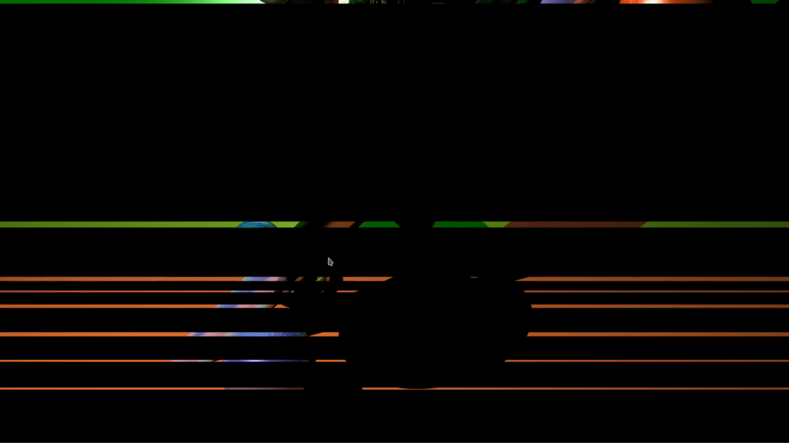

<p align="center">
    
</p>

# Raytracer
A multithreaded raytracer implemented in rust

## Running the raytracer
As every projects in rust, run with:

```shell
cargo run --release
```

## Configuration
Everything happens in the `src/main.rs` file.

### Resolution
Edit the `HEIGHT` and `WIDTH` constants at the beginning of the file:
```rust
const WIDTH: usize = 1920;
const HEIGHT: usize = 1080;
```

### Scene
Objects and lights are created in the `init_scene` function.
Add or remove them according to your needs.

For example:
```rust
let cylinder = Cylinder::new(
    Vector3::new(0.0, 5.0, 0.0),                // Position
    Vector3::new(1.0, 0.0, 1.0).normalize(),    // Direction vector *NEEDS TO BE NORMALIZED*
    0.5,                                        // Width of the cylinder
    Vector3::new(0.5, 0.5, 0.8),                // Color scaled from 0 to 1 in RGB
    0.5,                                        // Reflection index
    0.0                                         // Refraction index
);
scene.objects.push(Box::new(cylinder));         // Add the cylinder to the scene
```

## Features
- Sphere, Cylinder, Planes primitives
- Directionnal lights
- Spot lights
- Diffuse and total reflection

## Todo
- Cone primitive
- Amblient lightning
- Materials